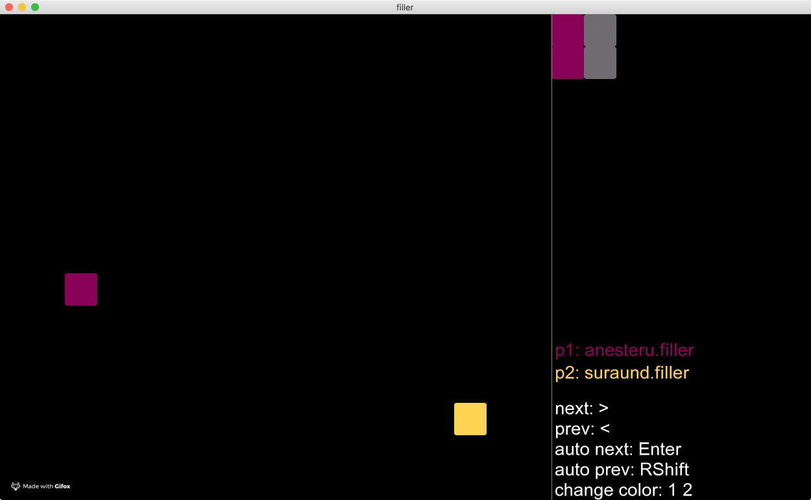
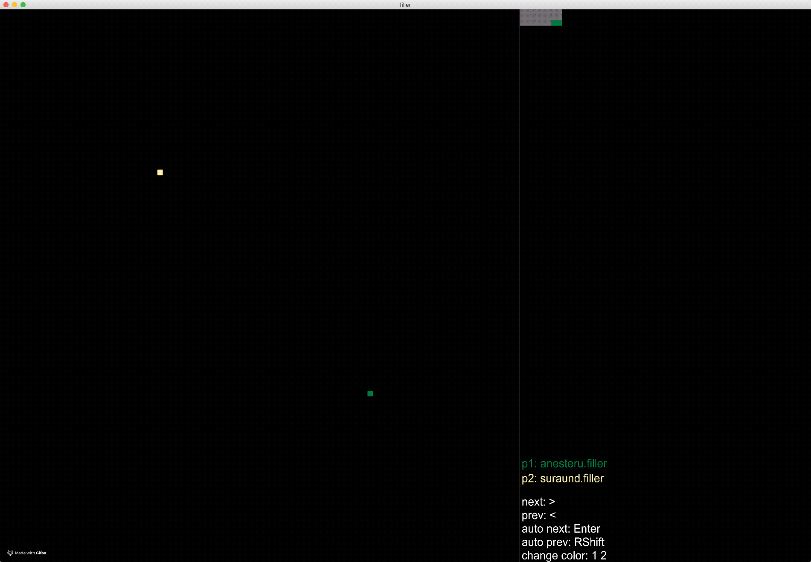

# filler
bot whose goal is to place more pieces on map then enemy. both map and pieces are provided by filler_vm.

SFML framework is used for visualization.

folder maps contains four maps of different sizes
folder players contains 8 different bots

How to use:

  ./filler_vm -f maps/map00 -p1 players/anesteru.filler -p2 players/carli.filler
  ./filler_vm -f maps/map00 -p1 players/anesteru.filler -p2 players/carli.filler | ./visualization

